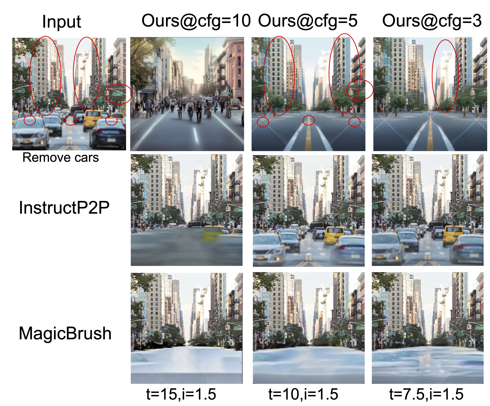
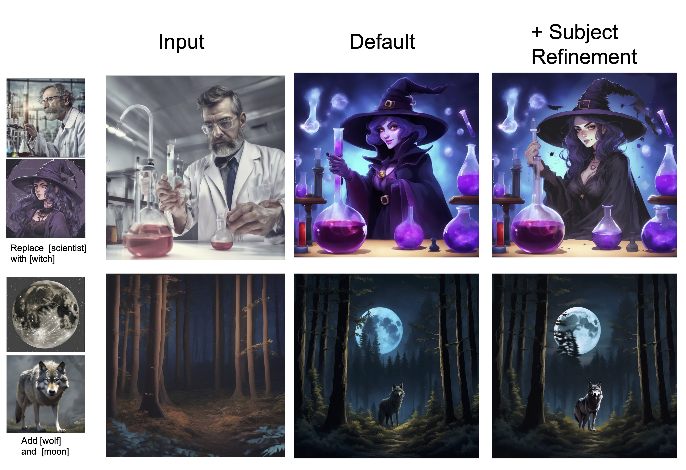
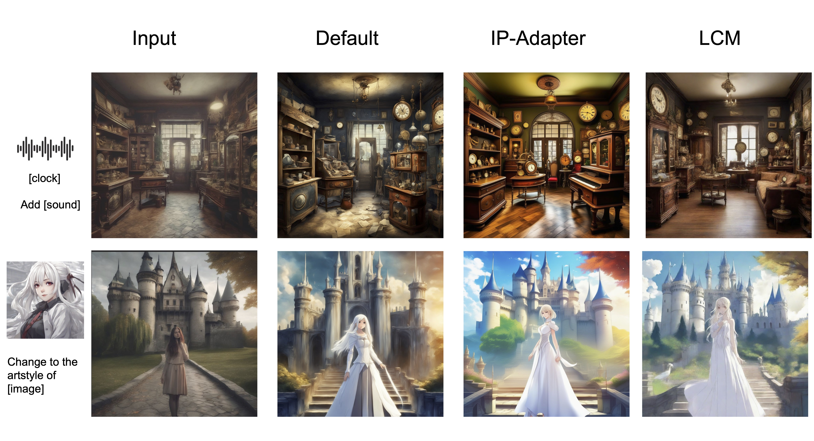

# InstructAny2Pix: Flexible Visual Editing via Multimodal Instruction Following


[DEMO](http://170.106.137.89:8888)  [Project Page](http://homepage.jackli.org/projects/instructany2pix.html)  [Paper](http://homepage.jackli.org/projects/Instructany2Pix.pdf)  [HuggingFace](https://huggingface.co/jacklishufan/instructany2pix/tree/main)  

PyTorch implementation of InstructAny2Pix: Flexible Visual Editing via Multimodal Instruction Following

Shufan Li, Harkanwar Singh, Aditya Grover 

University of California, Los Angeles


## Installation

```
conda create --name instructany2pix python=3.10
conda activate instructany2pix
conda install ffmpeg
pip3 install torch torchvision torchaudio
pip3 install -r requirements.txt
pip install git+https://github.com/facebookresearch/ImageBind.git --no-deps
```


## ChangeLogs
- 2023:
- [x] Dec 4: Added support for [LCM](https://github.com/luosiallen/latent-consistency-model) and [IP-Adapter](https://github.com/tencent-ailab/IP-Adapter)
- [x] Dec 30: Added support for Subject Consistency.
- 2024:
- [x] Feb 3: Added support for Cfg Control .
- [x] May 23: We temporally unlisted the model checkpoint due to [safety concerns](https://laion.ai/notes/laion-maintenance/) regarding LAION. We plan to retrain the model with clean data in near future.
- [x] Jun 30: We released retrained model on filtered clean data. See [New Demo Notebook](Demo-Retrained.ipynb) for use cases
- [x] Jul 20: We released Evaluation Dataset at [Huggingface](https://huggingface.co/datasets/jacklishufan/mm-instruct/tree/main).
- 2024:
- [x] Jan 23: Paper Accpeted to NAACL 2025 Findings
- [x] Jan 23: We released the training code. See  [Readme](scripts/train.md) for details

## Checkpoints

Checkpoints of Diffusion Model and LLM is available at [https://huggingface.co/jacklishufan/instructany2pix_retrained/].

<!-- ## Feb 3: Input Consistency

We add an new experimental hyperparameter in the demo which allows the user to contol the similarity between source image and results.

 -->

<!-- 
## Dec 30: New checkpoints for subject consistency

We added an experimental feature that supports subject consistency. When this feature is enabled, the edited image will follow additional reference images in addition to the source image. To enable this feature, set `llm_folder="llm-instance"` when initializating the pipeline and pass in `subject_strength=0.7` in the foward pass. Any value larger than zero will do in practice. We recommend 0.6 or 0.7 for a reasonable performance. See more details in updated paper.

 -->

<!-- 

## Dec 4: New diffusion models

We incroprate support for LCM and IP_Adapter. LCM can perform inference in just 4 step, while IP-Adapter improve generation quality in some circumstances. Below is a simple comparison

 -->

## Running

To serve gradio app, run
```
python serve.py
```

Alternatively, one can check `demo.ipynb` for a notebook demo

## Q&A

### Where can I find checkpoints
See Huggingface Link at the top

### The edit is not what I want

We are working on improving the roboustness of the method. At the moment, there are ways you can contorl the output.

#### It changes little
Try to Increase `alpha`, `norm`, decrease `h_0`

#### It changes too much
Try to decrese `alpha`, `norm`, decrese `h_0`

#### Low quality outputs
Try to Increase `refinement`, `h_2`, `steps`

#### Content of image is not intended
Try to change `seed` and increase `h_1`


## Acknowledgement

We make use of the following codebase for subject consistency:
[Segment Anything](https://github.com/facebookresearch/segment-anything)
[GroundingDINO](https://github.com/IDEA-Research/GroundingDINO)
